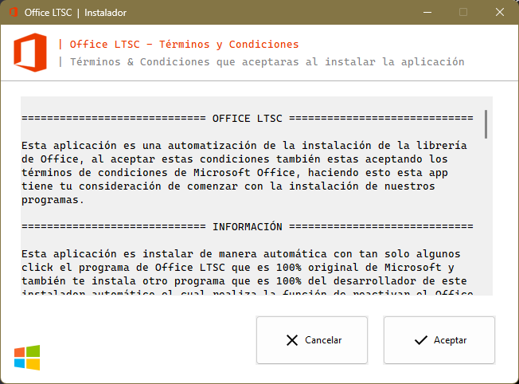
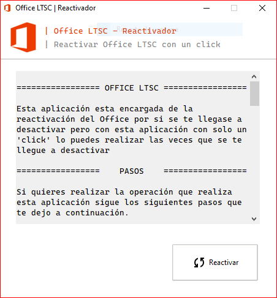

# OFFICE LTSC | INSTALADOR

- > Esta es una aplicación que su propósito general es la instalación visual del Office totalmente legal pero este solo tiene la version LTSC osea la aplicación que estas poniendo es el Office LTSC, la cual presenta un problema que ha sido resuelto con esta aplicación ya que también esta creada la aplicación del reactivador para que al momento que se te desactive la puedas activar de manera automática presionando un solo click.

- > La aplicación esta disponible para los siguientes sistemas operativos.

  [](https://www.microsoft.com/es-es/software-download/windows10)

# APLICACIÓN QUE VE EL USUARIO PARA INSTALAR



# PASOS PARA INSTALAR EL OFFICE DE MANERA MANUAL

> 1. Abre un navegador he ingresa la siguiente URL para descargar el Office LTSC.

```
https://www.microsoft.com/en-us/download/details.aspx?id=49117
```

> 2. Ahora en otra pestaña de tu navegador ingresa la siguiente URL para instalar el XML que es el encargado de la configuración.

```
https://www.mediafire.com/file/s4z18ydg8gkawp4/config.xml/file
```

> 3. Crea un carpeta con el nombre que quieras y mueve los dos archivos descargados dentro de este.

> 4. Abre un CMD como administrador en la ruta en donde estas.

> 5. Ejecuta el siguiente comando en el CMD:

```
setup /configure /config.xml
```

> 6. Preciosa la tecla "Enter" para que comience la instalación.

> 7.  Listo cierra todas las ventanas y desinstala el directorio.

#### - `Nota: Con esto no estas asegurado de que no se te desactive el office y no tendrás acceso a la aplicación para reactivar el Office LTSC nuevamente si este llegase a desactivarse la paquetería de office.`

#

# APLICACIÓN QUE VE EL USUARIO PARA REACTIVAR



#

# PASOS PARA REACTIVAR EL OFFICE DE MANERA MANUAL

> 1. Abre el buscador de archivos y copea y pega en la barra de direcciones la siguiente ruta

```
C:\Program Files\Microsoft Office\Office16
```

> 2. Ejecuta el programa con el nombre `OSPPREARM.EXE` tres veces con el modo administrador.

> 3. Listo ya quedo otra ves Office LTSC activado nuevamente.

> 4. (Opcional) Reinicia tu computadora para que no aya ningún inconveniente al abrir la paquetería de Office LTSC activado.

#### - `Nota: Este paso se tiene que hacer si ya tienes el office en tu dispositivo y se te aya desactivado de lo contrario no lo tienes que hacer.`
